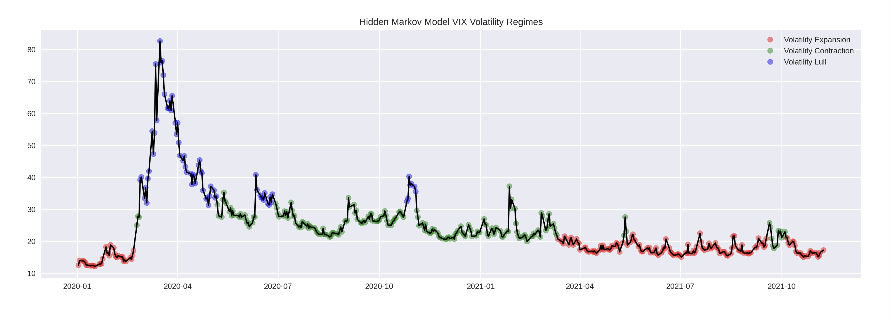

## Hidden Markov Models
### Identifying VIX Implied Volatility Regimes

Check it out on my <a href="https://github.com/walkerhughes/implied_volatility_regimes_hidden_markov_model">GitHub</a>

  

   
  

[back](./) 
