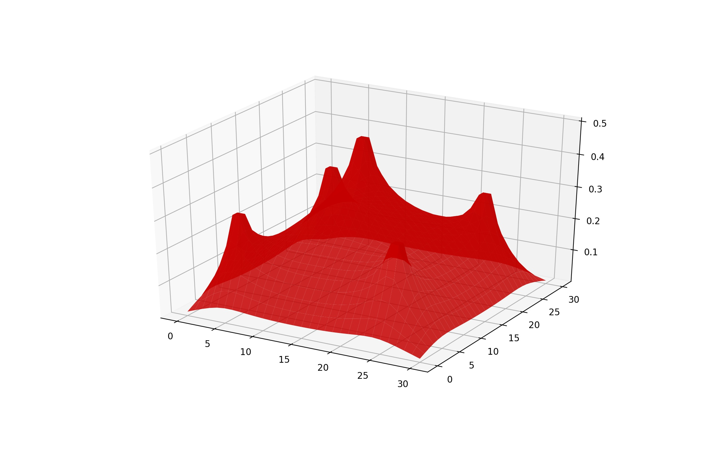

## Interior Point Optimization Applications 

<p>Check it out on my <a href="https://github.com/walkerhughes/interior_point_methods">GitHub</a></p>

<script type="text/javascript" async="" src="https://cdnjs.cloudflare.com/ajax/libs/mathjax/2.7.4/MathJax.js?config=TeX-MML-AM_CHTML"></script> 

Here I implement a quadratic interior point method and use KKT conditions to account for constraints. We'll use this to account for quadratic objective functions and apply the method to study elastic membranes for circus tents and Markowitz Portfolio Optimization.

For decades the Simplex algorithm was the only competitive method for linear optimization. One of the major shortcomings of the Simplex algorithm is that the number of steps required to solve the problem can grow exponentially with the size of the linear system. So for large linear programs, the Simplex algorithm is too computationally expensive to be a viable optimization method. Interior Point methods offer an alternative approach that have much better theoretical convergence properties.

```python  
import numpy as np
from scipy import linalg as la
from scipy.sparse import spdiags
from cvxopt import matrix, solvers
from matplotlib import pyplot as plt
from mpl_toolkits.mplot3d import axes3d
```

We can incorporate both equality and inequality constraints by implementing the KKT optimization condditions. Simply solving the KKT equations in a Primal-Dual interior point method can be too greedy, however, and this can cause us to step out of the feasible region of optimal points. So solve this, very smart people implemented the duality measure. Taking steps in directions that result in strictly decreasing duality measurers makes sure we stay in the feasible region and don't violate constraints. The following class implements an interior point routine for quadratic objective functions and allows for both equality and inequality constraints. The optimization problem becomes the following 

minimize 
<p><span class="math display">\[\frac{1}{2}x^TQx+c^Tx \]</span></p> 
subject to 
<p><span class="math display">\[ Ax \geq b, Gx=0 \]</span></p>  


<p>Full code available <a href="https://github.com/walkerhughes/interior_point_methods/blob/main/interior_point_quadratic.ipynb">here</a></p>

```python 
def qInteriorPoint(Q, c, A, b, guess, niter = 20, tol = 1e-16, verbose = False):
    """
    Solve the Quadratic program 
    
    min: .5 x^T Q x +  c^T x, 
    subject to: Ax >= b
    
    using an Interior Point method.

    Parameters:
        Q ((n,n) ndarray): Positive semidefinite objective matrix.
        c ((n, ) ndarray): linear objective vector.
        A ((m,n) ndarray): Inequality constraint matrix.
        b ((m, ) ndarray): Inequality constraint vector.
        guess (3-tuple of arrays of lengths n, m, and m): Initial guesses for
            the solution x and lagrange multipliers y and eta, respectively.
        niter (int > 0): The maximum number of iterations to execute.
        tol (float > 0): The convergence tolerance.

    Returns:
        x ((n, ) ndarray): The optimal point.
        val (float): The minimum value of the objective function.
    """
    m, n = A.shape 
    # only need to save shape of A 
    # since Q is n x n and y, mu, b in R^m
    
    e = np.ones(m) # vector of all ones 
    
    def F(x, y, mu): 
        """
        Returns KKT conditions for Lagrangian
        """
        Y, M = np.diag(y), np.diag(mu)
        return np.concatenate([Q @ x - A.T @ mu + c, A @ x - b - y, Y @ M @ e])
    
    
    def search_direction(x, y, mu): 
        """
        Solves the search-direction problem from equation (16.2)
        via LU decomposition of matrices 
        """
        sigma = 0.1 # centering parameter 
        zeros = np.zeros(m + n)
        Y, M = np.diag(y), np.diag(mu)
        v = (y.T @ mu) / m # duality measure 
        
        # perturbation vector 
        vector = np.concatenate((zeros, e)) * sigma * v # might need to change dimensions here
        right = -F(x, y, mu) + vector
        
        # diagonalize x, mu to create DF 
        X, M = np.diag(x), np.diag(mu)
        
        # components to create DF 
        zeros_mm = np.zeros((m, m)) # m x m square 
        zeros_nm = np.zeros((n, m)) # n X m ==> zeros_nm.T is m x n 
        I = np.eye(m) # we negate this to get -I 
        
        top = np.hstack((Q, zeros_nm, -A.T))   # top row 
        mid = np.hstack((A, -I, zeros_mm))     # mid row 
        bottom = np.hstack((zeros_nm.T, M, Y)) # bottom row 
        
        # stack to create DF 
        DF = np.vstack((top, mid, bottom))
        
        # factor with LU and solve 
        L, P = la.lu_factor(DF)
        soln = la.lu_solve((L, P), right)
        
        # divvy up the individual vectors 
        del_x = soln[:n]
        del_y = soln[n: n + m]
        del_mu = soln[n + m:]
        
        # return the del's 
        return del_x, del_y, del_mu
        
        
    def step_size(x, y, mu): 
        """
        Calculate the max-allowable step sizes while still staying
        in the feasible region of the problem 
        """
        Y, M = np.diag(y), np.diag(mu)
        # retrieve del's from search direction function 
        del_x, del_y, del_mu = search_direction(x, y, mu)
        
        # mask where we find appropriate alpha 
        mask = np.where(del_mu < 0)
        b = min(-mu[mask] / del_mu[mask])
        beta = min(1, 0.95 * b)
        
        # mask where we find appropriate delta 
        mask = np.where(del_y < 0)
        d = min(-y[mask] / del_y[mask])
        delta = min(1, 0.95 * d)
        
        # take alpha as min of these two parameters 
        alpha = min(beta, delta)
        
        # return the updated step sizes 
        return alpha * del_x, alpha * del_y, alpha * del_mu
    
    
    # get initial starting point from auxiliary
    x0, y0, mu0 = startingPoint(Q, c, A, b, guess)
    
    # run optimizer !! 
    for i in range(niter): 
        
        step_x, step_y, step_mu = step_size(x0, y0, mu0)
        
        x1 = x0 + step_x
        y1 = y0 + step_y
        mu1 = mu0 + step_mu
        
        # update duality measure 
        v = (y1.T @ mu1) / m
        
        print("Iteration {} - Duality Measure {}".format(i + 1, v))
        
        # if duality measure is less than tol
        # in other words, if we are close enough to the optimizer 
        if v < tol: 
            break 
    
        # update our " parameters "
        x0, y0, mu0 = x1, y1, mu1
       
    # return optimizer x1 and falue given x1 
    return x1, c.T @ x1
```

### Circus Tents and Elastic Membranes 

We'll use this to solve a problem with elastic membranes. 

Elastic membrane configurations can be described as solutions to an optimization problem. In this example we will find the shape of a large circus tent by solving a quadratic constrained optimization problem using our Interior Point method. 

Imagine a large circus tent held up by a set of poles. We can model the tent by a square two-dimensional grid, where each grid point has an associated number that gives the height of the tent at that point. 

At each grid point containing a tent pole, the tent height is constrained to be at least as large as the height of the tent pole. At all other grid points, the tent height is simply constrained to be greater than zero (ground height). 

We can then flatten this array to give a one-dimensional vector representation of the grid. If we let x be a one-dimensional array giving the tent height at each grid point, and L be the one-dimensional array giving the underlying tent pole structure (consisting mainly of zeros, except at the grid points that contain a tent pole), we have the linear constraint

<p><span class="math display">\[x \succeq L\]</span></p>  

The theory of elastic membranes claims that such materials tend to naturally minimize a quantity known as the Dirichlet energy. This quantity can be expressed as a quadratic function of the membrane. Since we have modeled our tent with a discrete grid of values, this energy function has the form

<p><span class="math display">\[\frac{1}{2}x^THx+c^Tx \]</span></p> 

where H is a particular positive semidefinite matrix closely related to Laplace's Equation, c is a vector whose entries are all equal to −(n − 1)^(−20, and n is the side length of the grid. Our circus tent is therefore given by the solution to the quadratic constrained optimization problem:

minimize 
<p><span class="math display">\[\frac{1}{2}x^THx+c^Tx \]</span></p> 
subject to 
<p><span class="math display">\[ x \succeq L \]</span></p>  

I'll use our interior point class to solve this optimization problem and plot the results. 

```python 
def laplacian(n):
    """
    Construct the discrete Dirichlet energy matrix H for an n x n grid
    """
    data = -1*np.ones((5, n**2))
    data[2,:] = 4
    data[1, n-1::n] = 0
    data[3, ::n] = 0
    diags = np.array([-n, -1, 0, 1, n])
    return spdiags(data, diags, n**2, n**2).toarray()


def circus(n = 15):
    """
    Solve the circus tent problem for grid size length 'n'.
    Display the resulting figure.
    """
    # Create the tent pole configuration.
    L = np.zeros((n,n))
    L[n//2-1:n//2+1,n//2-1:n//2+1] = .5
    m = [n//6-1, n//6, int(5*(n/6.))-1, int(5*(n/6.))]
    mask1, mask2 = np.meshgrid(m, m)
    L[mask1, mask2] = .3
    L = L.ravel()
    
    # Set initial guesses.
    x = np.ones((n, n)).ravel()
    y = np.ones(n**2)
    mu = np.ones(n**2)
    
    # Calculate the solution.
    H = laplacian(n)
    c = np.ones(n**2) / (-(n - 1)**2)
    A = np.eye(n**2)
    z = qInteriorPoint(H, c, A, L, (x, y, mu))[0].reshape((n, n))
    
    # Plot the solution.
    # plt.figure(figsize=(8, 8), dpi = 125)
    domain = np.arange(n)
    X, Y = np.meshgrid(domain, domain)
    fig = plt.figure(figsize = (11, 7), dpi = 125)
    ax1 = fig.add_subplot(111, projection='3d')
    ax1.plot_surface(X, Y, z, rstride=1, cstride=1, color='r', alpha = 0.85)
    
    plt.show()
```

```
Iteration 1 - Duality Measure 0.14246787705325453
Iteration 2 - Duality Measure 0.032457137687800494
Iteration 3 - Duality Measure 0.009857649500875969
Iteration 4 - Duality Measure 0.0029559499081747076
Iteration 5 - Duality Measure 0.0019625603730144556
Iteration 6 - Duality Measure 0.001187993483401118
Iteration 7 - Duality Measure 0.0005933332954588385
Iteration 8 - Duality Measure 0.00021140497003427746
Iteration 9 - Duality Measure 4.299443308907308e-05
Iteration 10 - Duality Measure 6.192750280848736e-06
Iteration 11 - Duality Measure 6.809047916289453e-07
Iteration 12 - Duality Measure 7.701218368148742e-08
Iteration 13 - Duality Measure 8.818479005237874e-09
Iteration 14 - Duality Measure 8.81910911933553e-10
Iteration 15 - Duality Measure 8.819170837294291e-11
Iteration 16 - Duality Measure 8.819177008587088e-12
Iteration 17 - Duality Measure 8.819177625712563e-13
Iteration 18 - Duality Measure 8.819177687425106e-14
Iteration 19 - Duality Measure 8.819177693596308e-15
Iteration 20 - Duality Measure 8.819177694213429e-16
```



Looks like a circus tent to me! 

This example was followed this lab closely froom the BYU ACME curriculum. 

<p>This example closely followed <a href="https://acme.byu.edu/00000179-af25-d5e1-a97b-bf65129f0000/interior22020-pdf">this</a> lab from the BYU ACME curriculum.</p>
