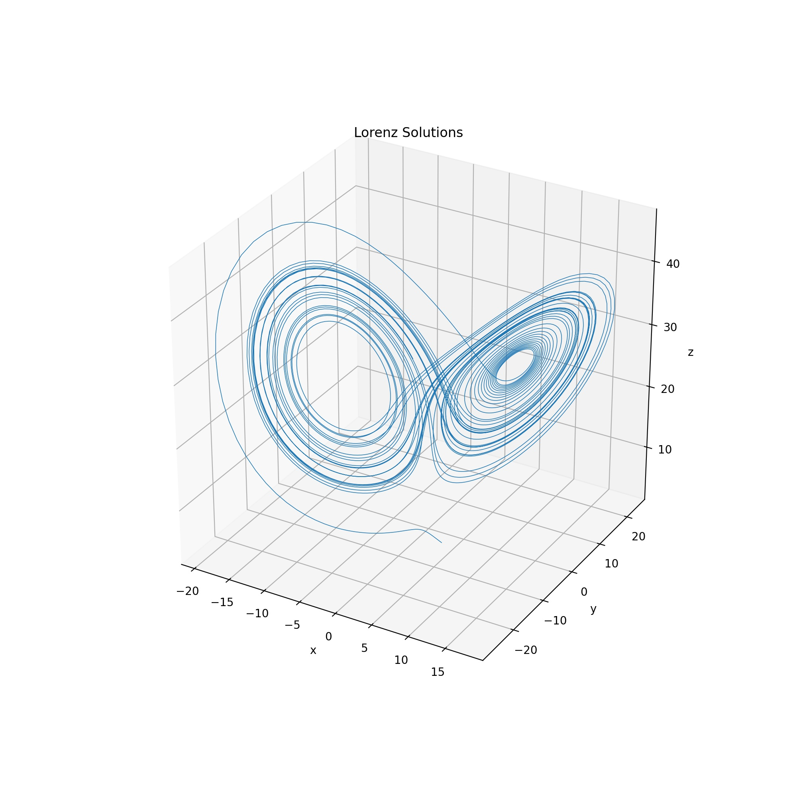
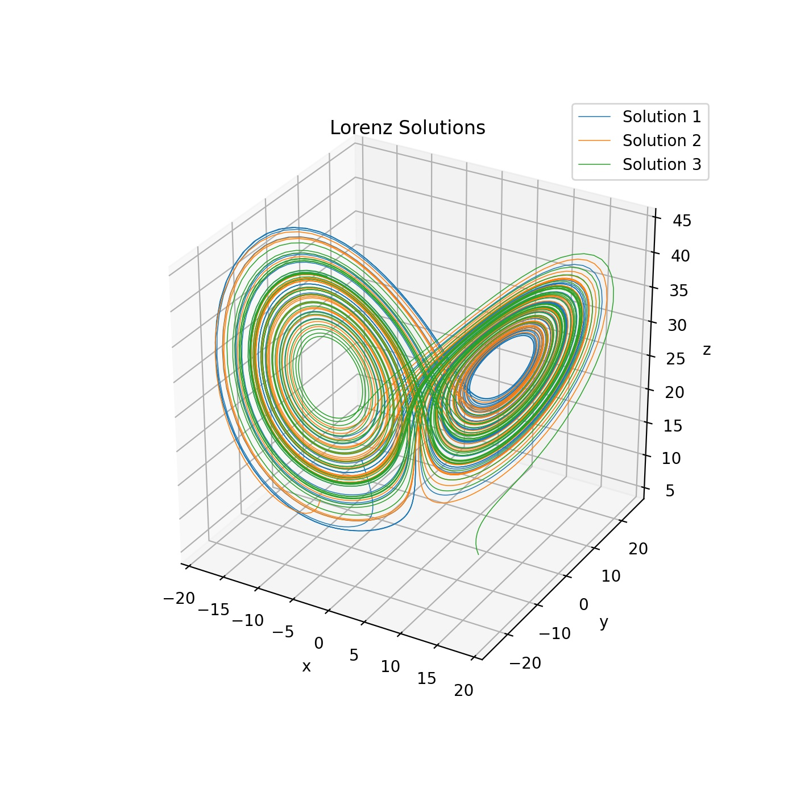

## Chaos Theory and Lorenz Equations

<p>Check it out on my <a href="https://github.com/walkerhughes/chaotic_systems_lorenz">GitHub</a></p>

<script type="text/javascript" async="" src="https://cdnjs.cloudflare.com/ajax/libs/mathjax/2.7.4/MathJax.js?config=TeX-MML-AM_CHTML"></script>  

One primary characteristic of chaos is that small changes in initial conditions result in large changes over time in the solution curves for a dynamic system. 

Here I implement the Lorenz equations: 

<p><span class="math display">\[x_t = \sigma (y - x), y_t = \rho x - y - xz, z_t = xy - \beta z\]</span></p> 

where <i>x_t<i> indicates the derivative of <i>x<i> wrt <i>t<i> and sigma, rho, and beta are constants. 

For appropriately chosen values of $\sigma, \rho,$ and $\beta$ the solutions did not tend to a fixed pooint, nor did the system tend to toward infnity either - there was chaotic behavior, and the system exhibited a "strange attractor."

Here we'll let $\sigma = 10$, $\rho = 28$, $\beta = 8$ and use `scipy.integrate.odeint` to compute the solution.

```python 
def lorenz(t, x):
    """
    Implements Lorenz equations:
    
    dx/dt = σ(y − x)
    dy/dt = ρx − y − xz
    dz/dt = xy − βz
        
    Parameters:
        x ((3,) ndarray): The state values (x,y,z)
        t (float): The time value t
    Returns:
        ((3,) ndarray): The derivative values
    """
    x, y, z = x[0], x[1], x[2]  
    sigma, rho, beta = 10, 28, 8/3 
    return np.array([sigma * (y - x), (rho * x) - y - (x * z), (x * y) - (beta * z)])  
```
```python 
# initial values 
initial_vals = np.random.uniform(-15, 15, (3, ))  

# solve the ODE 
sol = solve_ivp(lorenz, (0, 40), y0 = initial_vals, t_eval = np.linspace(0, 40, 5000))     
x, y, z = sol.y[0], sol.y[1], sol.y[2]  

ax = fig.add_subplot(111, projection = '3d')

ax.set_title("Lorenz Solutions") 
ax.set_xlabel("x")
ax.set_ylabel("y") 
ax.set_zlabel("z")

# plot solution 
line3d, = plt.plot(x, y, z, lw = .55) 
plt.show()
```



Now we'll plot three solutions to the Lorernz Equations, each with a slightly different initial condition. 

```python
# init plot figure 
fig = plt.figure(figsize = (7, 7)) 
ax = fig.add_subplot(111, projection = '3d')

# add titles and axes 
ax.set_title("Lorenz Solutions") 
ax.set_xlabel("x")
ax.set_ylabel("y") 
ax.set_zlabel("z")

for i in range(3): 

    # randomllly initial values 
    initial_vals = np.random.uniform(-15, 15, (3, ))  

    # solve the ODE 
    sol = solve_ivp(lorenz, (0, 40), y0 = initial_vals, t_eval = np.linspace(0, 40, 5000))     
    x, y, z = sol.y[0], sol.y[1], sol.y[2]     
    
    # plot solution
    line3d, = plt.plot(x, y, z, lw = .55, label = "Solution {}".format(i + 1))  

# set limits 
plt.legend() 
plt.show()
```


The Lyapunov exponent of a dynamical system is one measure of how chaotic a system is. While
there are more conditions for a system to be considered chaotic, one of the primary indicators of
a chaotic system is extreme sensitivity to initial conditions. Strictly speaking, this is saying that
a chaotic system is poorly conditioned. In a chaotic system, the sensitivity to changes in initial
conditions depends expoentially on the time the system is allowed to evolve. If δ(t) represents the
dierence between two solution curves, when δ(t) is small, the following approximation holds

<p><span class="math display">\[||\delta(t)|| ∼ ||\delta(0)|| e^{\lambda t}\]</span></p>  

where lambda is a constant called the Lyapunov exponent. In other words, the log of delta <i>t<i> is approximately <i>linear<i> as a function of time, with slope lambda, so we can estimate this through linear regression.

```python
# init solution to find point in attractor 
sol1 = solve_ivp(lorenz, (0, 50), y0 = init_cond, t_eval = np.linspace(0, 10, 5000)) 
init_cond = np.array([sol1.y[0][-1], sol1.y[1][-1], sol1.y[2][-1]]) 
# add perturbation to other initial condition 
init_cond2 = init_cond + (np.random.randn(3)*(1e-10)) 

# find two solutions to initial value problems 
sol1 = solve_ivp(lorenz, (0, 10), y0 = init_cond, t_eval = np.linspace(0, 10, 5000)) 
sol2 = solve_ivp(lorenz, (0, 10), y0 = init_cond2, t_eval = np.linspace(0, 10, 5000)) 

# take norm 
normed_sol = np.linalg.norm(sol1.y - sol2.y, axis = 0)  

# fit linear regression 
reg = linregress(np.linspace(0, 10, 5000), np.log(normed_sol)) 
slope, intercept = reg[0], reg[1] 
 
print(slope) 
```
```
0.9234478827176315
```
