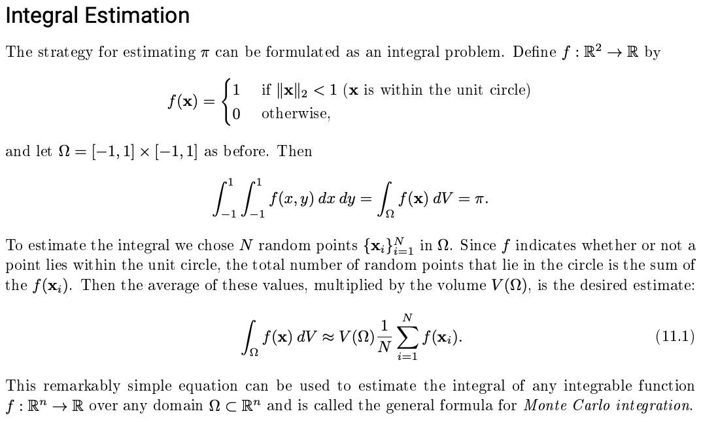

## Integrating Multivariate Functions with Monte Carlo Methods

<script type="text/javascript" async="" src="https://cdnjs.cloudflare.com/ajax/libs/mathjax/2.7.4/MathJax.js?config=TeX-MML-AM_CHTML"></script>  


```
import numpy as np
import scipy.stats 
import scipy.linalg as la 
import matplotlib.pyplot as plt 
```


## Motivation

Many multivariate functions like the Standard Normal Distribution's pdf cannot be symbolically integrated because their antiderivative does not exist. Quadrature methods are useful in most one-dimensional settings, but do not provide robust integrations in high-dimensions. Monte Carlo sampling provides an efficient (albeit slow) solution for high dimensional integration. 

A simple example oof how this is useful is when estimating pi. Pi is an irrational number, so its decimal expansion continues infinitely. We can still estimate it though, oone way being through Monte Carlo integration. We know the area of a circle is A = pi*r^2, where r is the circle radius. If r = 1 then, we have that the area is simply equal to pi itself. Intuitively, if we sample uniformly from a unit square centered at (0, 0), we can estimate pi as the ratio of sampled points from the unit square that fall within a circle with radius 1 inscribed in the square. Adjusting for the measure of the set we sampled from gives us our estimate. 

This explanation is taken from a text from the BYU ACME curriculum. 

 


### The n-Ball 

The open unit n-Ball is a ball that exists in n-dimensional space with radius 1. In one dimension this is a point, in two dimensions this is a circle, a sphere in 3 dimensions, and so on. In terms of set notation, we have 

<p><span class="math display">\[U_n = \{x\in R^n : ||x||_2 < 1\} \]</span></p> 

We can easily find the volume of any open n-ball with Monte Carlo integration. The basic idea is to sample uniformly over the domain for integration, apply our function restrictions to those sampled points, and find the portion of points sampled in that domain that meet the restriction that r<1, or that the sampled points have a 2-norm from the origin strictly less than 1. Lucky for us, we know that the volume of [-1, 1] x [-1, 1] x ... x [-1, 1] n times is 2^n. I implement this below. 

```python 
def ball_volume(n, num_samples = 10000):
    """
    Estimate the volume of the n-dimensional unit ball.

    Parameters:
        n (int): The dimension of the ball. n=2 corresponds to the unit circle,
                 n=3 corresponds to the unit sphere, and so on.
        N (int): The number of random points to sample.

    Returns:
        (float): An estimate for the volume of the n-dimensional unit ball.
    """
    # uniformly sample a grid of points in n dimensions 
    points = np.random.uniform(-1, 1, (n, num_samples))  

    # take norms from origin (this is how we enforce r < 1)  
    lengths = la.norm(points, axis = 0)

    # return our estimated volume via integration  
    return 2**n * np.count_nonzero(lengths < 1) / num_samples 
```
```python 
print("Estimated volume of unit sphere: {:.3f}".format(ball_volume(n = 3, N = 10**6)))

print("True value of unit sphere:       {:.3f}".format((4 / 3) * np.pi))

print("Estimated volume of a unit 4-ball is: {}".format(ball_volume(n = 4, N = 10**5))) 
```
```
Estimated volume of unit sphere:      4.183
True value of unit sphere:            4.189
Estimated volume of a unit 4-ball is: 4.91504
```

Our estimates improve as we sample more points to use, but this increases the temporal compllexity of the routine greatly. That said, this performed fairly well for an open unit n-Ball, but let's apply this to a more realistic example.


### Integrating the Standard Normal Probability Density Function 

The Normal Distribution appears all over the place in applied mathematics, statistics, machine learning, and virtually all other quantitative fields. Yet, it has noo closed-form solution for its Cumulative Distribution Function, which is the integral of its PDF. Luckily, we can use Monte Carlo for this integration. 


```python 

```

```python 

```

```python 

```

```python 

```

```python 

```