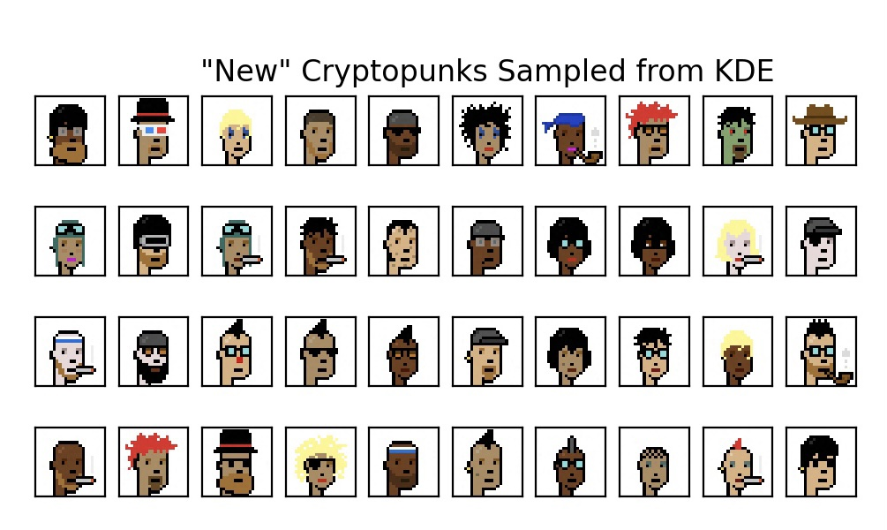

## Generating Original Cryptopunk NFT's with Kernel Density Estimates 

<script type="text/javascript" async="" src="https://cdnjs.cloudflare.com/ajax/libs/mathjax/2.7.4/MathJax.js?config=TeX-MML-AM_CHTML"></script> 

```python 
import glob
import numpy as np
from PIL import Image
import matplotlib.pyplot as plt
from sklearn.neighbors import KernelDensity
```

If you clicked on this, you might already know what NFTs are. If not, I’ll give a short explanation. 

NFT stands for non-fungible token. Something that is “fungible” is easily exchanged for or comparable to something similar to itself. A one-dollar bill is fungible because it can easily be exchanged for another dollar bill, or even four quarters. Non-fungible basically means “unique.” A “token” in this context is a crypto project built on top of an already existing blockchain it is not native to. For example, Ethereum is a blockchain whose native cryptocurrency is called Ether. Any other crypto project built on top of the Ethereum blockchain would be considered a token. NFTs are in large part built on top of the Ethereum blockchain (hence “token”) and are basically like having title to a specific asset in the sense that they ensure ownership of a specific, unique thing. 

NFTs have become very popular recently and the “Cryptopunks” are some of the most famous ones out there. All of them are made in a very similar style, but each is unique. There are about 10,000 original Cryptopunks and they often sell on OpenSea (an NFT marketplace) for big bucks. 

Below are a few examples of original Cryptopunks. 

 

A lot of notebooks I’ve seen of people trying to create original Cryptopunks use models like GANs and other deep learning architectures, but given the simplicity of the images, I can’t help but think this might be overkill.  

I decided to try and use Kernel Density Estimators instead. KDEs are some of my favorite models out there, and they walk the line between unsupervised learning, feature engineering, and data modeling. KDEs take different kernels and bandwidths as parameters, and using them here basically amounts to estimating the pixel distributions of the Cryptopunks, and then sampling new images from that estimated distribution. 

This was very straightforward, and training the KDE took a matter of seconds, rather than minutes or even hours as a fully architectured Neural Network might take. 

```python 
all_images = [] 

i = 1 
for image in glob.glob("./imgs/*"): 

    all_images.append(np.array(Image.open(image)).ravel())

    if len(all_images)%1000 == 0: 
        print("Checkpoint: {} images loaded".format(i * 1000)) 
        i += 1
``` 
```
Checkpoint: 1000 images loaded
Checkpoint: 2000 images loaded
Checkpoint: 3000 images loaded
Checkpoint: 4000 images loaded
Checkpoint: 5000 images loaded
Checkpoint: 6000 images loaded
Checkpoint: 7000 images loaded
Checkpoint: 8000 images loaded
Checkpoint: 9000 images loaded
Checkpoint: 10000 images loaded
```

```python
%time kde = KernelDensity().fit(all_images)  
```
```
CPU times: user 3.01 s, sys: 105 ms, total: 3.12 s
Wall time: 3.11 s
```

```python 
generated_cryptopunks = [kde.sample().ravel()]  
new_sample, original_generated_nft = False, False 

# generate new images and check they are original and unique 
while len(new_data) < 50:                          

    # sample cryptopunk from KDE model 
    potential_sample = kde.sample().ravel() 

    # check if potential_sample is a repeat of a previous sample 
    if not any([np.allclose(img, potential_sample) for img in new_data]):  
        new_sample = True 
    
    # check if potential_sample is a repeat of a true cryptopunk 
    if not any([np.allclose(img, potential_sample) for img in all_images]):  
        original_generated_nft = True 
    
    # save potential_sample if it's original and non-repeated 
    if all([new_sample, original_generated_nft]):   
        generated_cryptopunks.append(potential_sample)
    else: 
        print("Sampled image not true original NFT")
```

 


I looped through these newly generated images and compared each against all 10,000 original Cryptopunks to confirm they are unique. It’s pretty clear that the newly generated Cryptopunks are very similar to the originals, but I think this speaks more to the simplicity of the images than the quality of the model. That being said, KDEs are not to be underestimated! 

[back](./)