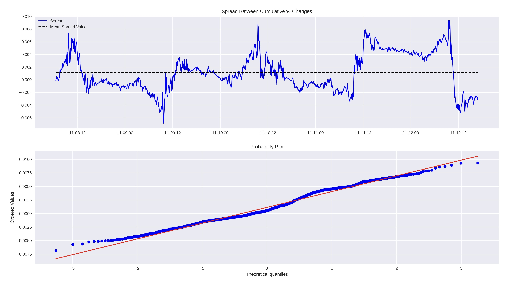

## Statistical Arbitrage and Pairs Trading 

 

Pairs trading is a market-neutral way to take advantage of mean reversion properties in the spread between two highly correlated assets. This is done by simultaneously taking a long position in one asset and a short position in the other. The strategy relies on arbitraging the distribution of the spread between the two asset prices, or the difference between the prices.  For this example, we’ll look at a pairs trade between the micro Nasdaq (/MNQ) and micro Russell (/M2K) futures in a 2:3 ratio, where the spread is 3/M2K - 2/MNQ. 

While we may not know the direction the market is going, pairs trading allows us to place trades based on extremes in the spread between the two assets under the assumption that this spread will likely revert to its long-term average. This makes more sense once we explore the distribution of this spread over time. Let’s start with a quick visual. 

In the first visual, we have the cumulative percentage returns for each asset for the week of November 8 through November 12 of 2021. Clearly, both assets closed the week for a loss (this week there was a particularly poor inflation reading of 6.2%). 

The second visual plots the spread between the cumulative percentage returns, or the cumulative percentage returns for 3/M2K contracts minus the cumulative percentage returns for 2/MNQ contracts. This looks like it may be normally distributed, but we’ll explore this further below. 

The third visual plots the P/L (profit vs. losses) for longing 3/M2K contracts and shorting 2/MNQ contracts and holding that trade through the entire week. 

 

