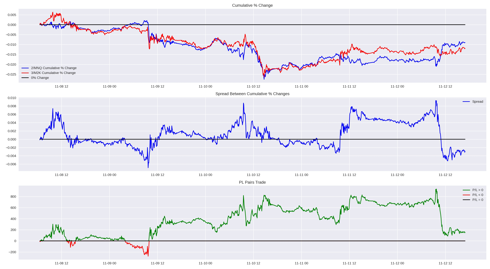

## Statistical Arbitrage and Pairs Trading 

 

Pairs trading is a way to arbitrage correlations between highly correlated assets. In this example we'll explore a pairs trade between the micro Nasdaq and micro Russell 2000 futures at a 2:3 ratio. This strategy aims to take advantage of mean reversion properties in the spread between these assets, or the price difference between them.  

What's nice about pairs trades is that they rely only on the correlation between two assets, not the direction the market is trending in. In this example, we'll look at a week in which both the Nasdaq and Russell futures closed for a loss on the week, yet we are still able to show how such a pairs traade is still profitable. 

Pairs trades 

 

