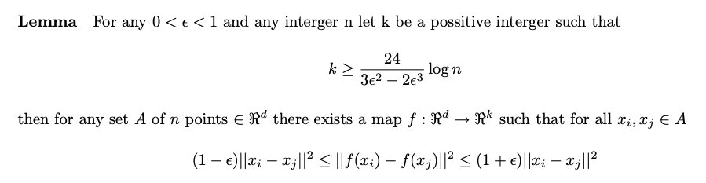

## Random Dimension Reduction of High-Dimensional Data 

<script type="text/javascript" async="" src="https://cdnjs.cloudflare.com/ajax/libs/mathjax/2.7.4/MathJax.js?config=TeX-MML-AM_CHTML"></script> 


```python 
import numpy as np 
from tqdm import tqdm
from time import time 
import scipy.stats as stats
from numpy.linalg import norm 
from sklearn.model_selection import ParameterGrid       
from sklearn.ensemble import GradientBoostingClassifier  
```

## Background On Dimension Reduction (full commentary coming soon!)  

High-dimensional data can be difficult to work with, both because it may take a long time to train a model with, and because many algorithms may suffer from the Curse of Dimensionality, which happens when data become very sparse in high dimensions rendering distance metrics unuseful. This is common with algorithms and models that rely on Euclidean distance for example, which is common in ML. Dimension reduction helps aleviate these troubles by projecting high-dimensional data into lower-dimensional representations, making modeling more computationally tractable and minimizing the effects of the Curse of Dimensionality.  

Principle Component techniques are very useful because they can project a data matrix to lower dimensions while allowing the user to view how much variance from the original data is preserved in this operation. Variance here is valuable information. This is done through the SVD of the data matrix, and is a linear dimension reduction. 

But other methods exist too, and can perform such dimension reduction randomly. I'll use one such method, the Johnson-Lindenstrauss method, and compare it to model accuracy for a ```GradientBoostingClassifier``` with unprojected data and PCA projected data. 

Let's make sure we understand the Johnson-Lindenstrauss method first, which relies on the Johnson-Lindenstrauss lemma stated below. This states that any n data points can be projected into k dimensions where 

<p><span class="math display">\[k \geq O(log(\frac{n}{\epsilon^2}))\]</span></p> 

Intuitively, this is stating that as we project daata points down to a lower dimension, we can preserve the distance between points to within 1 +/- epsilon, a parameter that we can choose. 




```python
def jl_bound(n, eps): 
    # returns Johnson-Lindenstrauss bound "k" from JL Lemma 
    return np.ceil((24 * np.log(n)) / (3*(eps**2) - 2*(eps**3))).astype(int)  
``` 

```python
def preserves_distance(X, A, eps): 
    # X \in M_{n, d} 
    # A \in M_{k, d}   
    n, d = X.shape  
    k, d = A.shape 

    # helper function to check if we are within (1 +/- epsilon) 
    def helper(xi, xj, A):  
        diff = xi - xj
        lower = (1 - eps) * norm(diff, ord = 2)**2    
        upper = (1 + eps) * norm(diff, ord = 2)**2 
        return lower <= norm(np.dot(A, diff), ord = 2)**2 <= upper         
    
    # list comprehension to check condition for each xi, xj 
    bools = np.array([[helper(X[i], X[j], A) for j in range(n) if i != j] for i in range(n)])       

    # return truth values      
    return all(bools.ravel())   
``` 

```python
attempts = [] 

for grid in tqdm(ParameterGrid({"n": [3, 10, 100], "eps": [0.7, 0.5, 0.1]})):   

        fails = 0
        n, eps = grid["n"], grid["eps"]
        k = jl_bound(n, eps) 
        X = np.random.rand(n, 10**5) 
        mu, sigma = 0, 1/np.sqrt(k) 
        A = np.random.normal(mu, sigma, (k, 10**5))   

        while not preserves_distance(X, A, eps):
            X = np.random.rand(n, 10**5)
            A = np.random.normal(mu, sigma, (k, 10**5))  
            fails += 1 

        attempts.append((n, eps, fails))  

print(attempts) 
``` 

```
[(3, 0.7, 0),
 (10, 0.7, 0),
 (100, 0.7, 0),
 (3, 0.5, 0),
 (10, 0.5, 0),
 (100, 0.5, 0),
 (3, 0.1, 0),
 (10, 0.1, 1),
 (100, 0.1, 0)] 
``` 

## Example With Some Familiar Data 
```python
from keras.datasets import fashion_mnist
(X_train, y_train), (X_test, y_test) = fashion_mnist.load_data()  

input_dim = 784 
X_train = X_train.reshape(60000, input_dim)
X_test = X_test.reshape(10000, input_dim) 

X_train = X_train / 255
X_test = X_test / 255

dims = sorted(list(np.random.choice(783, 78, replace = False)))  
obs = sorted(list(np.random.choice(59999, 6000, replace = False)))    

X_train_proj = X_train[obs, ][:, dims]  
X_test_proj = X_test[:, dims]   
X_train = X_train[obs,] 

y_train_proj = y_train[obs]  
y_train = y_train[obs] 
``` 

```python
start = time() 
model = GradientBoostingClassifier(loss = "deviance", n_estimators = 100, 
                                   max_depth = 5, min_samples_leaf = 3).fit(X_train, y_train) 

print("Training on un-projected data took {:.2f} seconds to train".format(time() - start))  
``` 

```
Training on un-projected data took 1030.00 seconds to train
```

```python
start = time() 
model_proj = GradientBoostingClassifier(loss = "deviance", n_estimators = 100, 
                                        max_depth = 5, min_samples_leaf = 3).fit(X_train_proj, y_train_proj) 

print("Training on randomly projected data took {:.2f} seconds to train".format(time() - start))  
``` 

```
Training on randomly projected data took 92.07 seconds to train 
```

```python
print("Model Accuracy trained on projected data:    {:.2f}".format(model_proj.score(X_test_proj, y_test)))
print("Model Accuracy trained on un-projected data: {:.2f}".format(model.score(X_test, y_test)))
``` 
```
Model Accuracy trained on projected data:    0.82
Model Accuracy trained on un-projected data: 0.85
```

### Now for Comparing to Linear Dimension Reduction with PCA

```python
%time U, e, Vt = np.linalg.svd(X_train, full_matrices = False) 
``` 
```
CPU times: user 1.74 s, sys: 224 ms, total: 1.96 s
Wall time: 1.07 s 
```

```python
X_train_pc_proj = np.dot(X_train, Vt[: 20].T) 
X_test_pc_proj = np.dot(X_test, Vt[: 20].T)  

start = time() 
model = GradientBoostingClassifier(loss = "deviance", n_estimators = 100, 
                                   max_depth = 5, min_samples_leaf = 3).fit(X_train_pc_proj, y_train)  
end = time() 

print("Total SVD/PCA projection training took {:.2f} seconds to train.".format(end - start))   
print("In total, this method took {:.2f} seconds to train.".format(1.07 + 70.48))   
print("The SVD/PCA Projection trained model got {:.2f} accracy.".format(model.score(X_test_pc_proj, y_test))) 
``` 

```
The SVD/PCA projection training took 70.48 seconds to train.
In total, this method took 71.55 seconds to train.
The SVD/PCA Projection trained model got 0.81 accracy.
```
