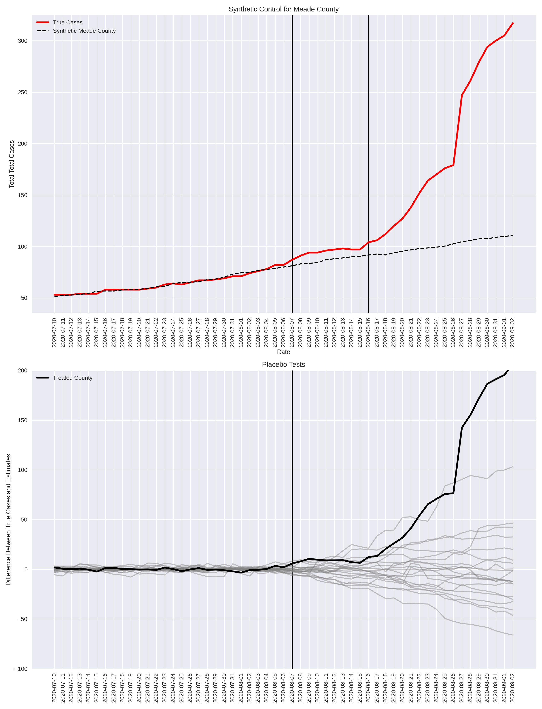

## Synthetic Control Methods
### Estimating the Effects of COVID-19 'Super Spreader' Events

Check out my full report on this with other identification strategies <a href="./econ488.pdf">here</a>
 

## What is a synthetic control anyway? 

Control groups are a key part of any scientific study when we want to see the effect a 'treatment' has on a specific group. In medicine, this could take the form of a randomized trial where a group of subjects is identified and half the group is given medicine, and half is given a placebo. We call the medicine group the 'treated group' and the placebo group the control. The control group allows us to see the effect the medicine had on the treated group in the counterfactual state of never having received the medicine, the key assumption here is that both groups are similar to each other on other observable characteristics and only differ on the basis of receiving the medicine or not. 

In comparative case studies, it can be difficult to find an adequate control group for a given treated unit. In these cases, we can construct a synthetic control group by taking a weighted average of groups that were similar enough to the treated group before they rereceived treatment. As an example, we will look at the Sturgis Motorcycle Rally that happened in August 2020 in Meade County, South Dakota. The rally annually draws thousands of people from all overe the US and it pressed on in the face of the COVID pandemic with minimal social distincing enforced. This begs the question: did this rally lead to the increase in COVID-19 cases reported in Meade County shortly after the rallly ended? 

Since we will never be able to know what COVID infection numberes were in Meade County had the rally not happened, we can create a synthetic control version of Meade County and use that to compare to the true observed cases. We will do this by finding other counties in the US that had similar case numbers prior to the rally and creating a weighted average of them such that the case numbers prior to the rally - August 7, 2020 - are similar to the true case numbers observed in Meade County. We then use this weighted average (our synthetic control for Meade) to forecast hypothetical cases for Meade had the rally not happened, and comparing those forecasts to the truth.  

We can sanity check our results by performing placebo tests, or perturbation tests. For each county used in constructing the synthetic control (the donor counties), we create a new synthetic control in the same way out of the other doner counties. We then similarly forecast out in time case number estimates after the onset of the rally and compare our estimates to the true case numbers for that county. These differences should be smaller in magnitude than those between true case numberes in Meade County and its synthetic control. 

This was also fun to implement from scratch in python since decent open-source python packages for synthetic controls seem few and far between. I implemented the optimization routine for finding weights for each synthetic control using the CVXPY library, and included L1 rergularization since the vector of these weights is ideally sparse to avoid overfitting the the pre-rally time period.

Using 21 US counties that best matched Meade County's COVID case numbers prior to August 7, 2020, we get the following rersults. The synthetic control for Meade County clearly shows fewer cases had the Rally not occured, and the difference between true case numbers and the synthetic control case numbers were farr more extreme for Meade County than forr any of the donor counties. This all suggests that the Rally likely had a significant effect on the rise in COVID cases in Meade County. 

Check out my synthetic control class on my <a href="https://github.com/walkerhughes/synthetic_control_super_spreader">GitHub</a>
 

    

 