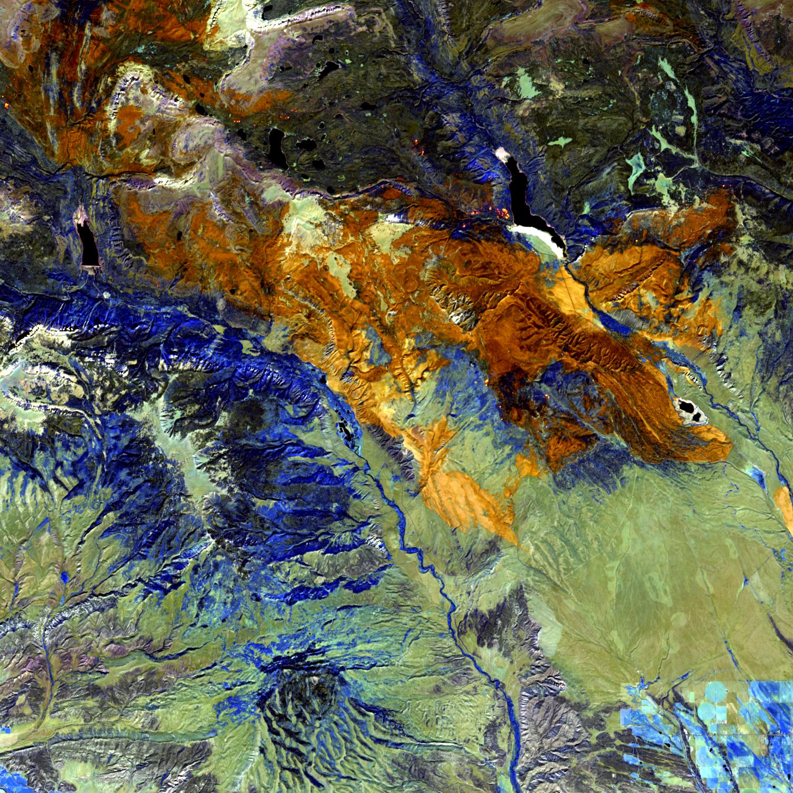
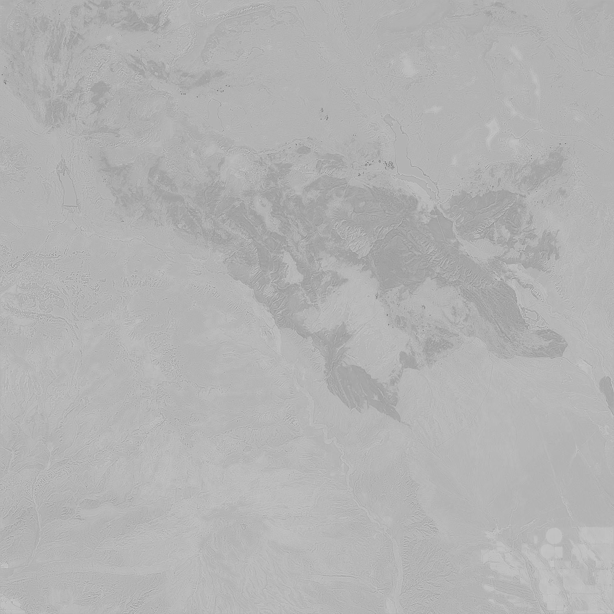
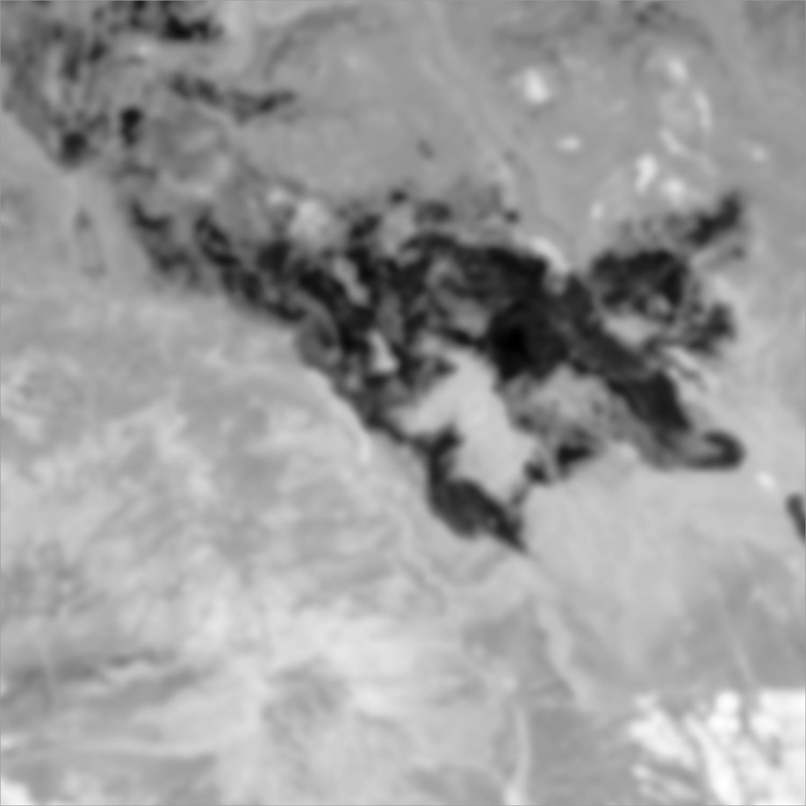
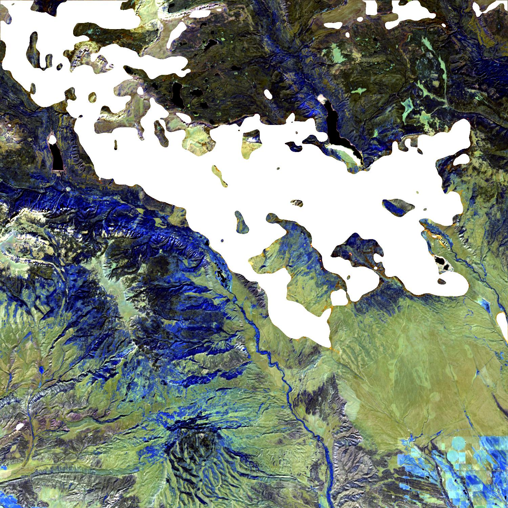

## Image Segmentation and Filtering For Estimating Wildfirer Perimeters 

Check it out on my <a href="https://github.com/walkerhughes/wildfire_perimeters">GitHub</a>

 

Estimating the true geographic coordinates of a raging wildfire's pereimeter can be difficult to do in real time due to many factors, including the resource constraints of first responders and smoke occlusion in typical RGB images. This is an important problem to solve, however, as knowing how a wildfire perimeter progresses over time can give insights to how the fire responds when introduced to different terrains, fuels, and atmospheric conditions. 

In California alone, the U.S. Forest Service spends about $200 million each year to suppress 98% of wildfires and up to $1 billion to suppress the other 2% of fires that escape initial ignition and become large. Being able to detect fires early on and track their real-time growth is not just important for environmental conservation, it's also economically crucial for public service organizations. 

While this is an inherently high dimenional problem, image segmentation provides a simple solution that affords us a high level of interpretability. It also works well when we do not have labeled data, so it is at times preferable to using another model like a convolutional neural network that must be trained on labeled data (indeed, estimating the fire perimeter is essentially the labeling process). Here I explore image segmentation and image filtering on Sentinel Satellite images for estimating the perimeter of the Center Creek Trail Fire that burned in Utah in 2020. 

The Sentinel Satellite orbits the earth and takes multispectral images of the planet, which contain far more chanels than just Red, Green, and Blue. Let's take a look at the atmospheric channels from a Sentinel Satellite image of this fire. These channels essentially filter through the smoke that would normally occlude an RGB image taken from above, and this allows us to more clearly view the burned areas. 

Center Creek Trail Fire, burned areas are in orange [Source: Sentinel Satellite] 
   

While we could feasibly use something like a floodfill algorithm at the pixel-color level to determine the burned areas, not all wildfires burn in convex shapes and there are often burned areas not at all connected to the main body of the burn. Further, a lot of images contain unneeded noise (random changes in pixel intensity or brightness) that isn't necessary. Image segmentation with additional image filtering is a straightforward way to address this. 

### Pre-Processing with Filters 

We can use Gaussian blurring (gaussian convolutions) and Laplace filtering to remove noise from the image and emphasize stark contrasts between pixel intensities that occur on the perimeters of a burn. We want to reduce noise in the image in order to focus on meaningful changes in color intensity, which indicate burned areas from not burned areas. This will make burned areas easier to recognize. We'll first use the gaussian blur filter, where the standard deviation parameter is user-specified.  

Gaussian Convolution Function 

\[ G(x, y) = \frac{1}{2 \pi \sigma^2} e ^ {-\frac{x^2 + y^2}{2 \sigma^2}} \]
 

Gaussian blurred image
      

We will also use Laplace filtering to emphasize the contrast between pixel intensities. The Laplace filter is a measure of the second spatial derivative on a 2D image and is useful for identifying such areas of rapid pixel intensity changes. This emphasizes fire perimeters clearly in our images. 
 
Laplace Filtering Function

\[ L(x, y) = \frac{\partial^2 I}{\partial x^2} + \frac{\partial^2 I}{\partial y^2} \]
 

Below is a single channel of the Laplace filtered image after applying the Gaussian blur. We can clearly see that the burned areas are emphasized in a darker grey compared to the rest of the image. In the original, we had greens, blues, oranges, and various other colors. By isolating specific channels after filtering, we can emphasize the difference between burned areas from raw terrain. 

Laplace filtered image 
     

Here are the two filters together, the Laplacian filter applied to the Gaussian blurred image. White areas are burned, so these differences are further apparent in this channel of the filtered image.   

      

When we complete the final segmentation with a simple numeric cutoff to decide what is burned and what is not, we get the following estimation of the wildfire perimeter. Knowing the geographic coordinates of the edges of the image makes this estimation of the fire perimeter easily mapped to lattitude and longitude coordinates. 

      

While this approach may seem simple, it is computationally inexpensive compared to alternatives like neural networks and does not require training on labeled data. When compared to the original image, we were able to efficiently label the fire perimeter in a way that is easily mapped to geographic coordinates.  

[back](./)
